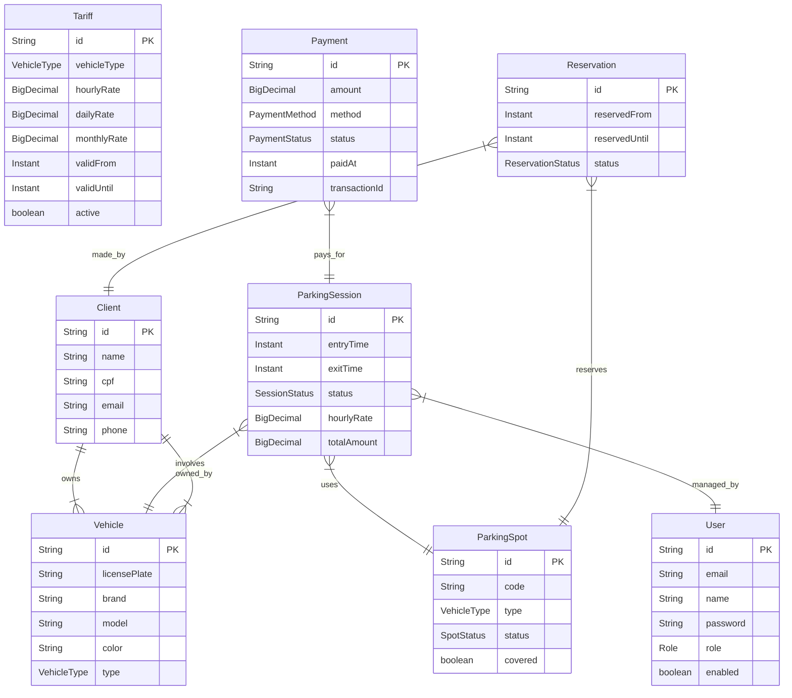

# 🚗 Parking Control System

> **"Gerenciamento de estacionamento inteligente, seguro e eficiente."**

Bem-vindo ao **Parking Control System**, uma solução robusta e moderna desenvolvida para simplificar a administração de estacionamentos. Este projeto combina tecnologias de ponta para oferecer controle total sobre vagas, sessões de estacionamento, pagamentos e clientes.

---

## 🌟 Destaques do Projeto

Este não é apenas um CRUD. É um sistema completo projetado com escalabilidade e segurança em mente.

* **🔐 Segurança de Nível Bancário**: Autenticação via JWT (JSON Web Tokens) com chaves RSA assimétricas.
* **⚡ Performance**: Construído sobre o Spring Boot 3.5.8 e Java 21 para máxima eficiência.
* **💾 Dados Flexíveis**: Persistência NoSQL com MongoDB, ideal para dados dinâmicos de sessões e logs.
* **📄 Documentação Viva**: API totalmente documentada com Swagger UI (OpenAPI).

---

## 🛠️ Tech Stack

As ferramentas que dão vida ao projeto:

| Categoria | Tecnologia | Versão |
| :--- | :--- | :--- |
| **Linguagem** |  | 21 |
| **Framework** |  | 3.5.8 |
| **Banco de Dados** |  | Latest |
| **Segurança** |  | OAuth2 / JWT |
| **Ferramentas** |   | - |

---

## 🚀 Funcionalidades

O sistema é dividido em módulos inteligentes:

### 🅿️ Gestão de Vagas (`ParkingSpot`)

* Cadastro e monitoramento de vagas.
* Status em tempo real (Ocupada/Livre).

### ⏱️ Sessões de Estacionamento (`ParkingSession`)

* Controle de entrada e saída de veículos.
* Cálculo automático de tempo de permanência.

### 💰 Pagamentos e Tarifas (`Payment` & `Tariff`)

* Gestão de tarifas dinâmicas.
* Processamento de pagamentos seguro.

### 👥 Gestão de Usuários e Clientes

* **Admin/User**: Controle de acesso baseado em roles.
* **Clientes**: Cadastro completo de clientes e seus veículos.

---

## 🏗️ Arquitetura

O projeto segue uma arquitetura em camadas limpa e organizada:

1. **Controllers**: Pontos de entrada RESTful.
2. **Services**: Regras de negócio complexas.
3. **Repositories**: Abstração de acesso a dados (MongoDB).
4. **Security**: Filtros de segurança e validação de tokens.

---

## 🗄️ Database Model

Abaixo está o diagrama Entidade-Relacionamento (ER) do sistema:



---

## 🏁 Getting Started

Siga os passos abaixo para rodar o projeto em sua máquina local.

### Pré-requisitos

* Java 21 JDK
* Maven
* MongoDB (Rodando localmente ou via Docker)

### Instalação

1. **Clone o repositório**

    ```bash
    git clone https://github.com/seu-usuario/parking-control.git
    cd parking-control
    ```

2. **Configure as Chaves JWT**
    O sistema espera chaves RSA para assinar os tokens. Gere-as (ou use as de exemplo para dev) e configure no `application.properties` ou variáveis de ambiente.

3. **Compile e Rode**

    ```bash
    mvn spring-boot:run
    ```

4. **Acesse a Documentação da API**
    Abra seu navegador em:
    `http://localhost:8080/swagger-ui.html`

---

## 🧪 Testes

Para garantir a qualidade, execute a suíte de testes:

```bash
mvn test
```

---

## 🤝 Contribuição

Contribuições são bem-vindas! Sinta-se à vontade para abrir issues ou enviar pull requests.

---

Feito com ☕ e código por Antonio
